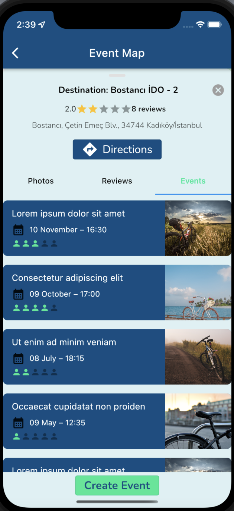

# BikeMate - Frontend of Social Media App For Bikers with Flutter

Implementation of the frontend of social media app for bikers.

## Table of Contents

- [General Info](#general-information)
- [Technologies Used](#technologies-used)
- [Features](#features)
- [Screenshots](#screenshots)
- [Setup](#setup)

## General Information

BikeMate is a social media platform which bikers can share posts and chat with each other, create events in biking locations by using Google Map to ride with their friends or people from all around the world. There is no backend for this application so all posts, users, events are hardcoded

## Technologies Used

- Flutter - 3.3.9
- Dart - 2.18.5
- All other libraries used in the app are specified in pubspec.yaml

## Features

Features of the application:

- Walkthrough page to show the goal of the application
- User login and signup page
- Homepage to see other users' posts
- Event page to see event on Google map
- Filtering locations on map by using icons
- Zoom in, out on map
- Show location of user on map
- Searching events by name
- A page to create events
- Creating route between user's location and event's location
- Seeing photos about the event
- Making reviews on events
- Seeing details and participants of events
- Editing profile details and picture
- Seeing old shared photos, old and current events of user
- Searching other users on search page
- Following other users

## Screenshots

## Setup

- To start the project, we need to install Flutter to our machine. By following instructions in https://docs.flutter.dev/get-started/install , you can install Flutter.

- After that you need an emulator to see the results. This app is coded accordingly to the Iphone 11 so I suggest to use Iphone 11 emulator to get the full experience.

## Usage

- You need to add Google Maps API Kee to use Events Page of the app. You can get this token by following instructions in https://pub.dev/packages/google_maps_flutter. After you get your API key, if you want to use map in IOS, you need to paste the key to specified area as "YOUR KEY" in file ./ios/Runner/AppDelegate.swift. If you want to use map in Android, you need to paste the key to specified area as "YOUR KEY" in file /Users/mac/Desktop/Practice/Flutter/BikeMate/android/app/src/main/AndroidManifest.xml
- Open your emulator (preferably Iphone 11).
- Write `flutter run` command on the terminal in root directory of the project.
